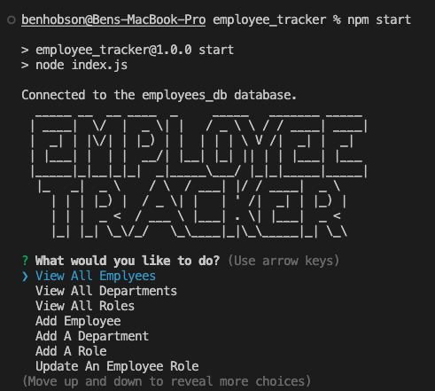

# employee_tracker

## Description

This project is a command line application running off MySQL, Node.js, and Inquirer. This application allows a user to view, and update their employee database for a specific company. The hardest parts of this assignment for me were figurimg out the logic for each function and the syntax for the MySQL queries. After hours of work I can not explain the relief I felt once the app functioned properly! As of right now you are able to view all the employees, departments and roles. Add new Employees, departments, and roles, and update an employees role. I structured my seeds.sql to create a data base full of restaurant emplyees.

## Installation

To use this app you must first clone the repository onto your co mputer, then start by inputing "npm i" in the integrated terminal to install the dependencies. After that you must insert your employees into the seed file or add them manually using the app itself.

## Usage

After Installing the dependencies you can run the app by inputting "npm start" into the integrated terminal. You will be presented with the apps title foloowed by "What would you like to do?" using your arrow keys you are able to toggle through the options and select what you would ike to do.

## Link To Video

https://drive.google.com/file/d/1JxWzBbDzonaMT8cvAn7tN0E5xJz0ks2t/view

## Screenshot

